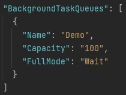

# Net.BackgroundTasks.Demo

> 這個專案專注於實作背景作業機制。  
> This project focus on implement background task mechanism.

練習實作背景作業機制於 .NET 上。  
To practice how background task mechanism implement on .NET.

## 運行專案

> 假如你想要直接測試應用程式，可以使用 [Postman](https://www.getpostman.com/) 或其他一些用於模擬 Client-side 行為的應用程式。

If you want to interactively test the application, you can use [Postman](https://www.getpostman.com/) or any other Http client.

> 透過 Visual Studio 2022 或者利用 `dotnet run` 指令先把專案跑起來。

1. Run the project from Visual Studio 2022 or by typing `dotnet run` in a command window.

> 至 http://localhost:5282/swagger/index.html

2. Go to http://localhost:5282/swagger/index.html.

> 嘗試佇列任務。

3. Try enqueue task.  
   

> 回到命令列視窗，你將會看到以下訊息：

4. Back to command window, your will see the message:  
   

> (可選) 你也可以設定佇列容量。

5. (Optional) You can set queue capacity.  
   

   - Name：Queue name
   - Capacity：Queue capacity
   - FullMode：Queue full mode (Wait、DropNewest、DropOldest、DropWrite)

## 參考

- [Queued background tasks](https://learn.microsoft.com/en-us/aspnet/core/fundamentals/host/hosted-services?view=aspnetcore-7.0&tabs=visual-studio#queued-background-tasks)
